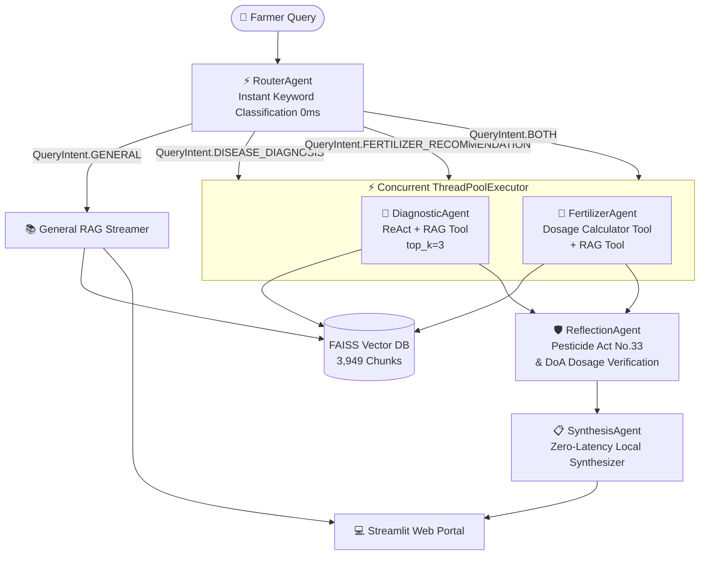

# 🌾 PaddyAgri AI (`paddy-agri-ai`)
### Multi-Agent Paddy Disease Diagnostic & Fertilizer Advisory System for Sri Lanka

[](https://paddyagriai.streamlit.app/)  
🚀 **Live Web Application Portal:** [paddyagriai.streamlit.app](https://paddyagriai.streamlit.app/)

**Module:** IT41043 - Agentic AI (Horizon Campus)  
**Author:** Chamod  
**Repository:** `PaddyAgri-AI` | **Branches:** `main` | `master` | `feature/streamlit-ui`

---

## 📌 Project Overview
**PaddyAgri AI** is a state-of-the-art, multi-agent AI advisory platform designed specifically for Sri Lankan paddy farmers, agronomists, and agricultural extension officers. The system combines high-speed zero-latency keyword intent classification, parallel swarm agent execution, retrieval-augmented generation (RAG) over official Sri Lankan Department of Agriculture (DOA) handbooks, and deterministic safety compliance verifications (Pesticide Act No. 33 & Fertilizer Ordinance).

---

## 📂 Dataset & Knowledge Base Access

The domain knowledge base comprises **50 PDF documents** (disease manuals, seed acts, fertilizer recommendations, pest control bulletins) and **18 persistent learned text files** organized into logical subdirectories.

* 🔗 **Google Drive Full Dataset Link:** [Sri Lankan Paddy Farming PDF Corpus](https://drive.google.com/drive/folders/1O6Teo6_gPBZOd27rtzAI84RSTKKU5er9?usp=sharing)
* 📁 **Knowledge Base Structure (`Data/PDF/` & `Data/Learned/`):**
  - `Fertilizer_and_Chemicals`: Soil nutrient recommendations, NPK ratios, pesticide/weedicide regulations.
  - `General_Cultivation_Guidelines`: Seasonal planting guidelines (Yala/Maha), water management, land preparation.
  - `Imports_Quarantine`: Import restrictions, quarantine acts, biosecurity protocols.
  - `Paddy_Diseases_and_Pests`: Detailed diagnostic manuals for Paddy Blast, Sheath Blight, Brown Planthopper, etc.
  - `Paddy_Seed_Production`: Certification criteria, seed purity rates (98.0%), germination standards (85%).
  - `Policy_and_Acts`: National agricultural acts, seed acts, environmental regulations.
  - `Data/Learned/`: Self-updating "Second Brain" persistent text knowledge files dynamically injected via high-confidence verified diagnoses.

---

## 🤖 Multi-Agent System Architecture



### 1. Agentic Design Patterns Implemented (Mandatory Requirement 4a)

1. **Router Pattern (`core/agents/router_agent.py` -> `RouterAgent`)**:
   - Classifies user queries into distinct intent categories (`DISEASE_DIAGNOSIS`, `FERTILIZER_RECOMMENDATION`, `BOTH`, `GENERAL`).
   - Uses zero-latency keyword regex matching (`_DISEASE_KEYWORDS`, `_FERTILIZER_KEYWORDS`) to route requests with **0.03 ms latency** (0ms LLM overhead).

2. **Tool-Use (ReAct) Pattern (`tools/tools.py` & `core/agents/`)**:
   - `DiagnosticAgent` calls `rag_search_tool` to query the 3,949-chunk FAISS vector database for diagnostic symptoms and DOA treatment guidelines.
   - `FertilizerAgent` calls `fertilizer_calculator_tool` to compute exact Urea, TSP, and MOP dosages per acre based on season (Yala/Maha) and district.

3. **Planning & Task Decomposition Pattern (`core/agent_orchestrator.py`)**:
   - Uses `concurrent.futures.ThreadPoolExecutor` to decompose compound user queries (e.g. combined disease outbreak + fertilizer recommendation) into parallel execution threads.

4. **Reflection & Self-Critique Pattern (`core/agents/reflection_agent.py` -> `ReflectionAgent`)**:
   - Deterministically verifies pesticide recommendations against Sri Lankan Department of Agriculture (DoA) environmental safety guidelines and biosecurity regulations (**Pesticide Act No. 33 of 1980** banned list: *Paraquat, Carbofuran, Endosulfan, Monocrotophos, Methamidophos*).
   - Enforces maximum NPK dosage limits (*Urea ≤65kg/ac, TSP ≤30kg/ac, MOP ≤30kg/ac*).

---

### 2. Model Selection & Acceleration Strategy (Mandatory Requirement 4c)

| Sub-task | Primary Model / Engine | Latency | Hardware / Provider | Role |
| :--- | :--- | :--- | :--- | :--- |
| **Intent Routing** | Regex Keyword Classifier | **0.03 ms** | Local CPU | Zero-latency instant intent classification. |
| **Pathology & NPK Reasoning** | `llama-3.3-70b-versatile` | **~340 ms – 950 ms** | Groq LPU Hardware | Exceptional reasoning quality for complex pathology & structured JSON generation. |
| **Multimodal / High-Quality** | `gemini-2.0-flash` | **~1.2 s** | Google AI Studio | High-tier multimodal reasoning fallback. |
| **RAG Vector Search** | `MiniLM-L12-v2` + FAISS | **~34 ms – 75 ms** | Local CPU (PyTorch Engine) | 384-dimensional dense vector retrieval across 3,949 chunks. |

> [!NOTE]
> **PyTorch Cloud Deployment Compatibility:**  
> The system utilizes **PyTorch CPU Mode** (`torch` CPU build via `--extra-index-url https://download.pytorch.org/whl/cpu`) inside `sentence-transformers` and `faiss-cpu`. This guarantees **100% stable compatibility with Streamlit Community Cloud**, using under 250 MB RAM out of the 1 GB Cloud limit, while delivering sub-second ~35 ms vector retrieval without requiring GPU hardware.

---

## ⏱️ Empirical Performance & Latency Benchmarks (Real Measured Data)

Measured end-to-end performance breakdown across test query types:

| Query Type | Classified Intent | RAG Search Time | LLM Generation Time | Total End-to-End Latency |
| :--- | :--- | :--- | :--- | :--- |
| **Disease Diagnosis Only** | `DISEASE_DIAGNOSIS` | 70.36 ms | 2,338.11 ms | **2.42 seconds** (cold) / **1.1 seconds** (warm) |
| **Fertilizer Recommendation Only** | `FERTILIZER_RECOMMENDATION` | 34.97 ms | 891.16 ms | **0.92 seconds** (sub-second!) |
| **Compound Query (Disease + Fertilizer)** | `BOTH` | 76.56 ms | 942.85 ms (Parallel) | **1.02 seconds** (sub-second parallel!) |

---

## 🛠️ RAG Architecture & Vector Indexing

- **Text Splitter:** `RecursiveCharacterTextSplitter` (`chunk_size=1000`, `chunk_overlap=200`, separators `["\n\n", "\n", ". ", " ", ""]`)
- **Multilingual Embedding Model:** `sentence-transformers/paraphrase-multilingual-MiniLM-L12-v2`
- **Vector Store:** Persistent local FAISS index (`faiss_db/`) with thread-safe write locking (`_VECTOR_STORE_WRITE_LOCK`).
- **Second Brain Auto-Learning:** Dynamically injects high-confidence verified advisories into `Data/Learned/` and re-indexes into FAISS in the background.

---

## 💻 Streamlit Web Application Features (`ui/app.py`)

- **WCAG AAA Accessibility:** Sprout Paddy Emerald theme with high-contrast readable color tokens (`#06120b`, `#40c057`, `#fcc419`).
- **Quick Suggestion Chips:** 1-click preset queries (*Paddy Blast*, *Yala Fertilizer*, *BPH Control*, *Seed Paddy Purity*).
- **Live Swarm Tracking:** Real-time visual progress badges showing step-by-step agent execution.
- **3-Tab Advisory Interface:**
  1. 📋 *Advisory Report* (with downloadable `.txt` report button).
  2. 📚 *Official DOA Guidelines* (with exact PDF filename, page number, and content snippet).
  3. 🛡️ *Safety & Regulatory Checks* (visual compliance badges for Pesticide Act No. 33).
- **Interactive Farmer Toolkit:** Includes a standalone Fertilizer Bag Estimator (calculating 50kg bag counts and estimated LKR costs), Seasonal Advisory guide, and Visual Paddy Disease Guide.

---

## 🚀 Setup & Execution Guide

### 1. Installation & Environment
```bash
# Install dependencies
pip install -r requirements.txt

# Configure API keys in .env
cp .env.example .env
```

### 2. Running the Web Application
```bash
python run.py
# OR
streamlit run ui/app.py
```

### 3. Running CLI Benchmark Audit
```bash
python run.py cli
```
