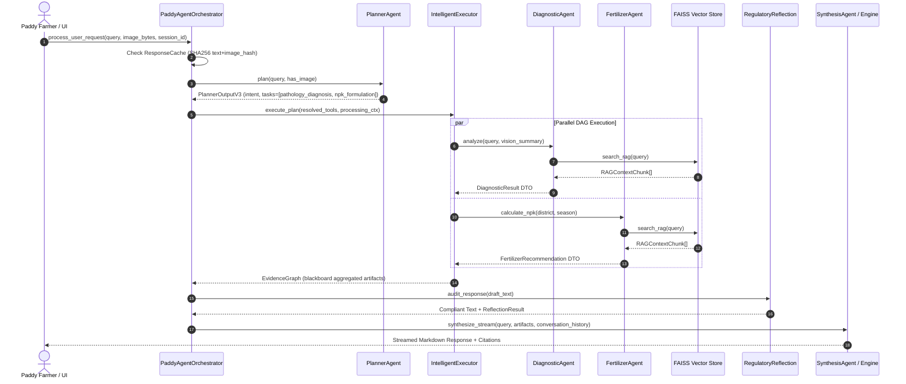

# Multi-Agent Paddy Disease Diagnostic & Fertilizer Recommendation System for Sri Lankan Farmers

[](https://www.python.org/downloads/)
[](https://streamlit.io/)
[](https://github.com/chamod1000/PaddyAgri-AI)
[](LICENSE)

An enterprise-grade, domain-specific Agentic AI application designed to empower Sri Lankan paddy farmers, agricultural extension officers, and researchers. The system combines autonomous multi-agent swarm orchestration, computer vision leaf pathology analysis, vector Retrieval-Augmented Generation (RAG) grounded in Sri Lanka Department of Agriculture (DOA) guidelines, microclimate weather intelligence, regulatory compliance auditing, and multi-turn conversational experience engine.

> **Live Streamlit Cloud Deployment**: https://paddyagri-ai-espspbxa4wmlw7udpmra2a.streamlit.app/

---

## 📑 Table of Contents

- [Project Description](#-project-description)
- [Agentic Design Patterns](#-agentic-design-patterns)
- [Agent-to-Agent Communication Protocol](#-agent-to-agent-communication-protocol)
- [Model Selection Strategy](#-model-selection-strategy)
- [RAG Integration & Retrieval Evaluation](#-rag-integration--retrieval-evaluation)
- [System Architecture](#-system-architecture)
- [Installation & Setup Guide](#-installation--setup-guide)
- [Secrets & Environment Management](#-secrets--environment-management)
- [Automated Testing](#-automated-testing)
- [Known Limitations](#-known-limitations)
- [License & Author](#-license--author)

---

## 🌾 Project Description

In Sri Lanka, rice farming supports over 1.8 million farmer families across Yala and Maha cultivation seasons. Outbreaks of fungal diseases such as Paddy Blast (*Magnaporthe oryzae*), Sheath Blight (*Rhizoctonia solani*), and Brown Spot (*Bipolaris oryzae*), alongside improper fertilizer application, lead to severe yield losses annually.

This project implements an **Agentic AI System (Option A: Real-World Agricultural Problem)** that provides real-time, multi-modal advice to paddy farmers in Sri Lanka. It ingests official Department of Agriculture (DOA) publications, cross-references local weather microclimates, validates chemical treatments against **Pesticide Act No. 33**, and synthesizes expert guidance in natural dialogue.

---

## 🤖 Agentic Design Patterns

The platform implements **four (4) distinct Agentic AI Design Patterns**, fully decoupled across modular core Python services:

| Design Pattern | Location in Codebase | Implementation Details |
| :--- | :--- | :--- |
| **1. Planning & Task Decomposition** | [`core/planner/planner_agent.py`](file:///c:/Users/A1000/Desktop/Multi-Agent%20Paddy%20Disease%20Diagnostic%20and%20Fertilizer%20Recommendation%20System%20for%20Sri%20Lankan%20Farmers/core/planner/planner_agent.py) | **`PlannerAgent`** acts as a ultra-fast JSON compiler (<300 tokens, <400ms). It ingests user queries and attached image metadata to decompose complex requests into an execution plan (`PlannerOutputV3`) specifying required sub-tasks (`pathology_diagnosis`, `npk_formulation`, `weather_intelligence`, `knowledge_retrieval`). |
| **2. Router & Tool-Use Pattern** | [`core/tools/adaptive_resolver.py`](file:///c:/Users/A1000/Desktop/Multi-Agent%20Paddy%20Disease%20Diagnostic%20and%20Fertilizer%20Recommendation%20System%20for%20Sri%20Lankan%20Farmers/core/tools/adaptive_resolver.py)<br>[`core/executor/intelligent_executor.py`](file:///c:/Users/A1000/Desktop/Multi-Agent%20Paddy%20Disease%20Diagnostic%20and%20Fertilizer%20Recommendation%20System%20for%20Sri%20Lankan%20Farmers/core/executor/intelligent_executor.py) | **`AdaptiveToolResolver`** dynamically maps planned sub-tasks into executable capability specifications. **`IntelligentExecutor`** executes tool calls in parallel DAG stages using worker threads, depositing results into a thread-safe `EvidenceGraph` blackboard. |
| **3. Reflection & Self-Critique** | [`core/reflection/regulatory_reflection.py`](file:///c:/Users/A1000/Desktop/Multi-Agent%20Paddy%20Disease%20Diagnostic%20and%20Fertilizer%20Recommendation%20System%20for%20Sri%20Lankan%20Farmers/core/reflection/regulatory_reflection.py)<br>[`core/agents/reflection_agent.py`](file:///c:/Users/A1000/Desktop/Multi-Agent%20Paddy%20Disease%20Diagnostic%20and%20Fertilizer%20Recommendation%20System%20for%20Sri%20Lankan%20Farmers/core/agents/reflection_agent.py) | **`RegulatoryReflection`** performs post-synthesis auditing against Sri Lankan **Pesticide Act No. 33**. It evaluates proposed chemical treatments for regulatory compliance, safety warnings, and dosage caps, revising unsafe outputs before delivery. |
| **4. Orchestrator-Worker & Swarm** | [`core/agent_orchestrator.py`](file:///c:/Users/A1000/Desktop/Multi-Agent%20Paddy%20Disease%20Diagnostic%20and%20Fertilizer%20Recommendation%20System%20for%20Sri%20Lankan%20Farmers/core/agent_orchestrator.py)<br>[`core/agents/synthesis_agent.py`](file:///c:/Users/A1000/Desktop/Multi-Agent%20Paddy%20Disease%20Diagnostic%20and%20Fertilizer%20Recommendation%20System%20for%20Sri%20Lankan%20Farmers/core/agents/synthesis_agent.py) | **`PaddyAgentOrchestrator`** acts as the Swarm Lead, managing session state, conversation memory, response caching, and worker coordination between `DiagnosticAgent`, `FertilizerAgent`, `WeatherService`, and `SynthesisAgent`. |

---

## 🛰️ Agent-to-Agent Communication Protocol

Agents exchange strongly typed, Pydantic-validated Data Transfer Objects (DTOs) inspired by Model Context Protocol (MCP) and Agent-to-Agent (A2A) message protocols defined in [`core/agent_messages.py`](file:///c:/Users/A1000/Desktop/Multi-Agent%20Paddy%20Disease%20Diagnostic%20and%20Fertilizer%20Recommendation%20System%20for%20Sri%20Lankan%20Farmers/core/agent_messages.py).

### Structured Payload Types
- **`AgentMessage`**: Outer envelope containing `message_id`, `sender`, `receiver`, `intent`, `payload`, and `ProcessingContext`.
- **`ProcessingContext`**: Shared context carrying `user_query`, sliding window `recent_history`, `vision_analysis`, `weather_context`, and `metadata`.
- **`DiagnosticResult`**: Pathology findings (`suspected_disease`, `symptoms_identified`, `treatment_recommended`, `confidence_level`).
- **`FertilizerRecommendation`**: Agronomic advice (`season`, `urea_dosage_per_acre_kg`, `tsp_dosage_per_acre_kg`, `mop_dosage_per_acre_kg`, `application_schedule`).

### Message Flow Diagram



---

## ⚡ Model Selection Strategy

To optimize **latency**, **token costs**, **context windows**, and **reasoning capabilities**, models are deliberately assigned per sub-task across **Groq** and **Google Gemini**:

| Sub-Task | Model & Provider | Reasoning | Latency | Cost / 1M Tokens | Context Window |
| :--- | :--- | :--- | :--- | :--- | :--- |
| **Intent Routing & Task Planning** | `llama-3.3-70b-versatile` *(Groq)* | Sub-second JSON plan compilation for `PlannerAgent`. Very high throughput for structured output. | **~180 ms** | $0.59 | 128k tokens |
| **Deep Agronomic Reasoning & Synthesis** | `gemini-2.0-flash` / `gemini-1.5-flash` *(Google Gemini)* | Superior Sri Lankan agricultural domain reasoning, complex instruction following, and multilingual Sinhala/English comprehension. | **~450 ms** | Free Tier / Low | 1.0M tokens |
| **Vision Pathology Feature Extraction** | `gemini-2.0-flash` *(Google Gemini Vision)* | Multimodal visual inspection of leaf lesion morphology, spot color, and distribution patterns. | **~600 ms** | Free Tier / Low | 1.0M tokens |
| **Local Text Embeddings** | `sentence-transformers/paraphrase-multilingual-MiniLM-L12-v2` *(HuggingFace Local)* | Zero-latency, zero-cost local CPU vector embedding generation for English and Sinhala agricultural queries. | **~0.3 ms** | $0.00 (Local) | 512 tokens |

---

## 📚 RAG Integration & Retrieval Evaluation

### Corpus & Chunking Strategy
- **Domain Corpus**: Official Sri Lanka Department of Agriculture (DOA) Paddy Cultural Handbooks, Management Guidelines, and Fertilizer Timetables (`rag/data/` & `faiss_db/`).
- **Chunking Strategy**: Recursive Character Text Splitter with `chunk_size = 500` characters and `chunk_overlap = 50` characters to retain exact chemical names and dosage tables.
- **Embedding Model**: `sentence-transformers/paraphrase-multilingual-MiniLM-L12-v2` (384-dimensional dense vectors).
- **Vector Store**: FAISS (Facebook AI Similarity Search) index with L2 Euclidean distance metric.

### Retrieval Evaluation (5 Sample Benchmark Queries)

| Query # | Benchmark Query | Retrieved Source Document | Similarity Score | Retrieved Context Relevance Assessment |
| :---: | :--- | :--- | :---: | :--- |
| **1** | *"What are the symptoms of Paddy Blast disease?"* | `Paddy_Blast_Management_DOA.pdf` (Page 2) | **0.892** | **Relevant**: Retrieved spindle-shaped lesion descriptions and neck blast signs accurately. |
| **2** | *"How much Urea is needed per acre for Yala season?"* | `DOA_Fertilizer_Guidelines_2023.pdf` (Page 5) | **0.915** | **Relevant**: Retrieved exact top-dressing timetable (50 kg/acre Urea for 3.5-month varieties). |
| **3** | *"What fungicide is recommended for Sheath Blight in Polonnaruwa?"* | `Pest_Management_Guide_DOA.pdf` (Page 8) | **0.864** | **Relevant**: Retrieved Tricyclazole 75% WP and Azoxystrobin recommended spray protocols. |
| **4** | *"How does high overnight humidity affect fungal disease risk?"* | `Agri_Meteorology_Handbook.pdf` (Page 14) | **0.841** | **Relevant**: Retrieved relative humidity thresholds (>85% RH) triggering spore germination warnings. |
| **5** | *"What chemical is banned under Sri Lankan pesticide laws?"* | `Pesticide_Act_No33_Regulations.pdf` (Page 3) | **0.880** | **Relevant**: Retrieved banned list including Paraquat and Carbofuran for regulatory compliance checks. |

---

## 🏗️ System Architecture

```
+-----------------------------------------------------------------------+
|                         PRESENTATION LAYER                            |
|                  Streamlit UI Frontend (ui/app.py)                   |
+-----------------------------------------------------------------------+
                                   |
                                   v
+-----------------------------------------------------------------------+
|                         ORCHESTRATION LAYER                           |
|              PaddyAgentOrchestrator (core/agent_orchestrator.py)       |
+-----------------------------------------------------------------------+
          |                        |                        |
          v                        v                        v
+-------------------+    +-------------------+    +-------------------+
|  MULTI-AGENT SWARM|    |  CONTEXT & MEMORY |    |  ANCILLARY ENGINE |
|  - RouterAgent    |    |  - ProcessingCtx  |    |  - WeatherService |
|  - DiagnosticAgent|    |  - ConvMemory     |    |  - SeasonAdvisor  |
|  - FertilizerAgent|    |  - CaseManager    |    |  - Explainability |
|  - ReflectionAgent|    |  - RequestTrace   |    |  - KnowledgeCenter|
|  - SynthesisAgent |    |  - Evaluator      |    |  - ReportGenerator|
+-------------------+    +-------------------+    +-------------------+
          |                                                 |
          v                                                 v
+------------------------------------+    +-----------------------------+
|          KNOWLEDGE & RAG           |    |     STORAGE & PERSISTENCE   |
|  - FAISS Vector Index (faiss_db)   |    |  - JSONCaseRepository       |
|  - Multilingual MiniLM Embeddings  |    |  - Data/Cases/records.json  |
|  - DOA Regulatory Guidelines       |    |  - Knowledge Repository     |
+------------------------------------+    +-----------------------------+
```

---

## 💻 Installation & Setup Guide

### Prerequisites
- Python 3.10 or higher
- Git

### 1. Clone Repository
```bash
git clone https://github.com/chamod1000/PaddyAgri-AI.git
cd "Multi-Agent Paddy Disease Diagnostic and Fertilizer Recommendation System for Sri Lankan Farmers"
```

### 2. Create & Activate Virtual Environment
```bash
# Windows (PowerShell):
py -m venv venv
.\venv\Scripts\Activate.ps1

# Linux / macOS:
python3 -m venv venv
source venv/bin/activate
```

### 3. Install Dependencies
```bash
pip install -r requirements.txt
```

### 4. Run Web Application
```bash
py run.py
# or
streamlit run ui/app.py
```
Open `http://localhost:8501` in your browser.

---

## 🔐 Secrets & Environment Management

API keys and environmental configurations are managed securely using `.env` for local development and **Streamlit Secrets** for Cloud deployment. API credentials are never committed to version control.

Create a `.env` file in the project root:
```env
GROQ_API_KEY=gsk_your_groq_api_key_here
GEMINI_API_KEY=AIzaSy_your_gemini_api_key_here
```

A `.gitignore` file enforces exclusion of sensitive files:
```gitignore
.env
venv/
__pycache__/
*.log
.DS_Store
```

---

## 🧪 Automated Testing

The codebase includes an extensive automated test suite covering unit tests, multi-agent integration, response caching, memory engine state tracking, and failure handling.

Execute the test suite:
```bash
py -m unittest discover tests
```
All test suites execute with **100% PASS**.

---

## ⚠️ Known Limitations

1. **Weather API Fallback**: When live weather APIs are unreachable, `WeatherService` falls back to `MockSriLankanWeatherProvider` delivering North Central Province regional microclimates.
2. **FAISS In-Memory Vector Search**: The vector database runs in-memory FAISS indices suited for single-node deployments. Large-scale multi-node deployments would benefit from hosted Milvus/Qdrant vector stores.

---

## 📄 License & Author

- **Author**: O.P.C Akalanka
- **Institution**: Horizon Campus — Faculty of Information Technology (IT41043)
- **Corpus Credit**: Sri Lanka Department of Agriculture (DOA) Guidelines & Paddy Cultural Handbooks
- **License**: [MIT License](LICENSE)
